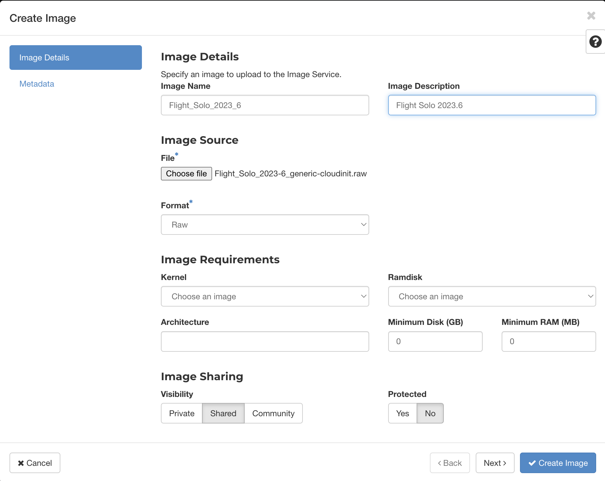
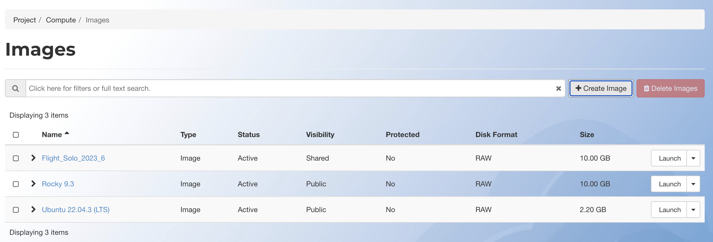

---
authors:
  - shubhamdang
date: 2024-03-06
categories:
  - se1
readtime: 5
---

# Create a Single Node Slurm Cluster

In this blog, we'll guide you through the seamless upload of Flight solo image on alces cloud and then followed by the installation of a slurm standalone cluster installation. Our setup involves a single nodes that has slurm manager installed on it and that can be further used to execute HPC workloads.

Let's start with a step-by-step process, starting from uploading flight solo image, then creating virtual machines on the Alces Cloud platform, followed by verification of setup by running a simlple HPC job.
<!-- more -->

## Upload Flight Solo Image

- Download the Flight Solo OpenStack image [here](https://repo.openflighthpc.org/?prefix=images/FlightSolo/)
- Upload the image

    === "GUI"
        To upload the image on Alces Cloud you can utilise the Image Wizard.
        On the left side bar, navigate to `Compute` and then `Images`. On the top right, click `Create Image` to open the wizard. Fill the image information like name, description, image source (path of flight solo image downloaded in above step), image format, image visibility and Protected, then click `Next` to add image metadata if required.

        [](images/image-wizard-1.png)

        Once metadata are also done, then click `Create Image` to uplad the image to cloud. When Image is uploaded successfully then it will be visible in image listing page.
        
        [](images/image-wizard-2.png)

    === "CLI"
        ```bash
        openstack image create --disk-format raw --min-disk 10 --min-ram 2048 --file /path/to/Flight_Solo_VERSION_generic-cloudinit.raw Flight_Solo_VERSION_generic-cloudinit
        ```

        Example of Flight Solo Image Upload
        ```bash
        openstack image create --disk-format raw --min-disk 10 --min-ram 2048 --file Flight_Solo_2023-6_generic-cloudinit.raw Flight_Solo_2023_6
        +------------------+--------------------------------------------------------------------------------------------------------------------------------------------------------+
        | Field            | Value                                                                                                                                                  |
        +------------------+--------------------------------------------------------------------------------------------------------------------------------------------------------+
        | container_format | bare                                                                                                                                                   |
        | created_at       | 2024-03-07T03:57:06Z                                                                                                                                   |
        | disk_format      | raw                                                                                                                                                    |
        | file             | /v2/images/96384e7b-af90-47e3-b5c9-fbe7343200a9/file                                                                                                   |
        | id               | 96384e7b-af90-47e3-b5c9-fbe7343200a9                                                                                                                   |
        | min_disk         | 10                                                                                                                                                     |
        | min_ram          | 2048                                                                                                                                                   |
        | name             | Flight_Solo_2023_6                                                                                                                                     |
        | owner            | 17234a6cc8954d748ed74a31680ea39b                                                                                                                       |
        | properties       | os_hidden='False', owner_specified.openstack.md5='', owner_specified.openstack.object='images/Flight_Solo_2023_6', owner_specified.openstack.sha256='' |
        | protected        | False                                                                                                                                                  |
        | schema           | /v2/schemas/image                                                                                                                                      |
        | status           | queued                                                                                                                                                 |
        | tags             |                                                                                                                                                        |
        | updated_at       | 2024-03-07T03:57:06Z                                                                                                                                   |
        | visibility       | shared                                                                                                                                                 |
        +------------------+--------------------------------------------------------------------------------------------------------------------------------------------------------+
        ```

## Launch the Instance

=== "GUI"
    To launch your instance on Alces Cloud you can utilise the Launch Instance wizard.

    On the left side bar, navigate to `Compute` and then `Instances`. On the top right, click `Launch Instance` to open the wizard. Choose a suitable name for your instance, then  click `Next`.

    [](docs/starter/img/instance-wizard-1.png)

    Choose an image from the available list by pressing the up arrow next to the desired image, as well as a suitable volume size. Note: different images may have different requirements - you can view these by pressing the arrow to the left of the image name. Click `Next`.

    [](docs/starter/img/instance-wizard-2.png)

    Choose the flavor size for your instance. More information on the available flavors can be found [here](../compute/flavors.md). Click `Next`.

    [](docs/starter/img/instance-wizard-3.png)

    Choose the network to attach your instance to. Your project will come with a default network already configured for you to use. More information on networks can be found [here](../networking/networks.md). 

    Ensure the `default` network is selected and then click `Next` twice to move to the `Security Group` section.

    [](docs/starter/img/instance-wizard-4.png)

    Choose the security groups to apply to your instance. Your project will come with 3 security groups by default. More information on security groups can be found [here](../networking/secgroups.md).

    Select the `default` and `allow-ssh` security groups by pressing the up arrow next to these, then click `Next`.

    [](docs/starter/img/instance-wizard-5.png)

    Ensure the key pair you created earlier is selected, and then click on `Launch Instance` to launch it.

    [](docs/starter/img/instance-wizard-6.png)

    Launching your instance may take a few moments, after which it will be shown in the `Running` state on your `Instances` page.

    ##Connecting to your Instance

    In order to connect to your instance, you will need to associate a floating IP with the instance. Click the drop down arrow to the right of your instance and then select `Associate Floating IP`.

    [](docs/starter/img/instance-wizard-7.png)

    To allocate a new floating IP to your project, press the `+` button and then `Allocate IP`.

    [](docs/starter/img/instance-wizard-8.png)

    Ensure the IP that was just allocated is selected, and then select your instance from the drop down menu. Click `Associate` to then associate the IP.

    [](docs/starter/img/instance-wizard-9.png)

    You should now be able to SSH to your instance using floating IP and the `.pem` file downloaded earlier. This can be done using the `ssh` command on most Linux systems. Different images may require you to login as a different user - more information on the standard Alces images can be found [here](../compute/images.md).

    You may also be asked to accept the instance host key the first time you connect to a new instance. Type `yes` here to continue.

    ```
    [user@fedora ~]$ ssh -i MyKeypair.pem rocky@10.199.31.5
    The authenticity of host '10.199.31.5 (10.199.31.5)' can't be established.
    ED25519 key fingerprint is SHA256:87OxF7SkU/D6jXbY9XmwElnME9fK6qUaBVlTDlbVnDQ.
    This key is not known by any other names
    Are you sure you want to continue connecting (yes/no/[fingerprint])? yes
    Warning: Permanently added '10.199.31.5' (ED25519) to the list of known hosts.
    [rocky@myinstance ~]$ 
    ```


=== "CLI"

    Instances are virtual machines that run inside the cloud, Before we launch an instance we need to gather the following information:

    - Instance source can be an image, snapshot, or block storage volume that contains an image or snapshot.
    -  Name of the instance.
    - The flavor for your instance, which defines the compute, memory, and storage capacity of nova computing instances.
    - A key pair for your instance, which are SSH credentials that are injected into images when they are launched.
    - A security group that defines which incoming network traffic is forwarded to instances.
    - Any user data files. A user data file is a special key in the metadata service that holds a file that cloud-aware applications in the guest instance can   access.
    - If needed you can assign a floating (public) IP address to a running instance to access the instance on the public network.
    - You can also attach a block storage device, or volume, for persistent storage.


    ### Collect Parameters to launch an virtual machine

    Before you begin, source the OpenStack RC file to fetch all the information to required to create a instance.

    List the available flavors.
    ```bash
    openstack flavor list
    +--------------------------------------+----------+-------+------+-----------+-------+-----------+
    | ID                                   | Name     |   RAM | Disk | Ephemeral | VCPUs | Is Public |
    +--------------------------------------+----------+-------+------+-----------+-------+-----------+
    | 3bd3b3e8-b1c0-4968-868a-d411f03aa0b6 | p1.small | 49152 |    0 |      1228 |     6 | False     |
    | b8ac5f5e-6fcb-4f4f-ac6f-98ac1443ca1c | p1.large | 98304 |    0 |      2456 |    12 | False     |
    +--------------------------------------+----------+-------+------+-----------+-------+-----------+
    ```

    List the available Images
    ```bash
    openstack image list
    +--------------------------------------+----------------------+--------+
    | ID                                   | Name                 | Status |
    +--------------------------------------+----------------------+--------+
    | b7e0d27f-1266-4069-a9b8-fb8a71f25421 | Rocky 9.3            | active |
    | 8711c1da-71f8-4c09-85bd-6efdc2346188 | Ubuntu 22.04.3 (LTS) | active |
    +--------------------------------------+----------------------+--------+
    ```

    List the available Key Pairs
    ```bash
    openstack keypair list
    +-------------+-------------------------------------------------+------+
    | Name        | Fingerprint                                     | Type |
    +-------------+-------------------------------------------------+------+
    | alces_key   | 8a:cf:tc:b1:c8:82:46:d0:c6:e9:1f:98:b8:32:02:04 | ssh  |
    +-------------+-------------------------------------------------+------+
    ```

    List the available security Groups
    ```bash
    openstack security group list
    +--------------------------------------+-------------+-------------------------------------------+----------------------------------+------+
    | ID                                   | Name        | Description                               | Project                          | Tags |
    +--------------------------------------+-------------+-------------------------------------------+----------------------------------+------+
    | a5c693ab-431c-4059-b0a2-e64e9636e51d | allow-https | Allows HTTP (80/tcp) and HTTPS (443/tcp). | 17234a6cc8954d748ed74a31680ea39b | []   |
    | cc99563e-1110-494b-8b3f-d411c8ece659 | allow-ssh   | Allows SSH (22/tcp) access.               | 17234a6cc8954d748ed74a31680ea39b | []   |
    | df9dc0fb-0d91-4e06-8aa5-477c6b1fe254 | default     | Default security group                    | 17234a6cc8954d748ed74a31680ea39b | []   |
    +--------------------------------------+-------------+-------------------------------------------+----------------------------------+------+
    ```


    List the available Networks
    ```bash
    openstack network list
    +--------------------------------------+-----------------------+--------------------------------------+
    | ID                                   | Name                  | Subnets                              |
    +--------------------------------------+-----------------------+--------------------------------------+
    | c681d94b-e2ec-4b73-89bf-9943bcce3255 | external1             | 8a1961f9-030c-419e-9bf0-66875031073f |
    | cff8f325-db1b-4812-974a-9bee346a84bd | alces-testing-default | 920ba89b-4f27-4c35-8862-9d457bc6a677 |
    +--------------------------------------+-----------------------+--------------------------------------+
    ```

    ### Launch Virtual Machine and associate floating IP

    After you collect required parameters, run the following command to launch an instance. Specify the server name, flavor ID, image ID, network ID, keypair Name and security group ID.

    ```bash
    openstack server create --flavor 3bd3b3e8-b1c0-4968-868a-d411f03aa0b6 --image b7e0d27f-1266-4069-a9b8-fb8a71f25421 --security-group default --security-group allow-https --security-group allow-ssh  --key-name shubham_key --network cff8f325-db1b-4812-974a-9bee346a84bd --boot-from-volume 20 --wait myvm
    ```

    Once Virtual machine is created we can assign floating ip to the instance so that we can access the machine on public network.

    First we need to find for floating IPs that are available to allocate to the virtual machine, If `Fixed IP Address` is `None` then floating IPs are available.

    ```bash

    openstack floating ip list
    +--------------------------------------+---------------------+------------------+------+--------------------------------------+----------------------------------+
    | ID                                   | Floating IP Address | Fixed IP Address | Port | Floating Network                     | Project                          |
    +--------------------------------------+---------------------+------------------+------+--------------------------------------+----------------------------------+
    | 20319840-3043-4915-bcf4-f53098450f2e | 10.199.31.3         | None             | None | c681d94b-e2ec-4b73-89bf-9943bcce3255 | 17234a6cc8954d748ed74a31680ea39b |
    | cb8414b6-4ed0-4987-bc9b-298ac8a62704 | 10.199.31.116       | None             | None | c681d94b-e2ec-4b73-89bf-9943bcce3255 | 17234a6cc8954d748ed74a31680ea39b |
    +--------------------------------------+---------------------+------------------+------+--------------------------------------+----------------------------------+

    ```

    Otherwise we need to allocate floating IP from the external network pool, in our example name of external network is `external1`.
    
    ```bash
    openstack floating ip create
    ```

    Once the flaoting IP is available, Associate an IP address with an instance in the project, as follows:
    ```bash
    openstack server add floating ip INSTANCE_ID FLOATING_IP_ADDRESS

    # Example
    openstack server add floating ip myvm 10.199.31.3
    ```


    Verification of Server creation and assocation of floating IP can be done by the below command.

    ```bash
    openstack server list
    +--------------------------------------+------+--------+-------------------------------------------------+--------------------------+--------+
    | ID                                   | Name | Status | Networks                                        | Image                    | Flavor |
    +--------------------------------------+------+--------+-------------------------------------------------+--------------------------+--------+
    | 00ab05c7-9590-47a2-9d20-1647fca5e0bb | myvm | ACTIVE | alces-testing-default=10.199.31.3, 172.16.0.158 | N/A (booted from volume) | dan1   |
    +--------------------------------------+------+--------+-------------------------------------------------+--------------------------+--------+
    ```


## Create Slurm Cluster Using Flight Solo


1. Parse your node(s) with the command `flight hunter parse`.

    1. This will display a list of hunted nodes, for example
        ```bash 
        [flight@myinstance.novalocal ~]$ flight hunter parse
        Select nodes: (Scroll for more nodes)
        ‣ ⬡ myinstance.novalocal - 10.10.0.1
        ```

    1. Select the desired node to be parsed with ++space++, and you will be taken to the label editor
        ```bash
        Choose label: login-node.novalocal
        ```

    1. Here, you can edit the label like plain text
        ```bash
        Choose label: login1
        ```

        !!! tip
            You can clear the current node name by pressing ++down++ in the label editor.

    1. When done editing, press ++enter++ to save. The modified node label will appear next to the ip address and original node label.
        ```bash
        Select nodes: login-node.novalocal - 10.10.0.1 (login1) (Scroll for more nodes)
        ‣ ⬢ myinstance.novalocal - 10.10.0.1 (login1)
        ```

    1. From this point, you can either hit ++enter++ to finish parsing and process the selected nodes, or continue changing nodes. Either way, you can return to this list by running `flight hunter parse`.

    1. Save the node inventory before moving on to the next step.

        !!! tip
            See `flight hunter parse -h` for more ways to parse nodes.

### Add genders

1. **Optionally**, you may add genders to the newly parsed node. For example, in the case that the node should have the gender `cluster` and `all` then run the command:
    ```bash
    flight hunter modify-groups --add cluster,all login1
    ```

## SLURM Standalone Configuration


1. Configure profile

    ```bash
    flight profile configure
    ```

    1. This brings up a UI, where several options need to be set. Use up and down arrow keys to scroll through options and enter to move to the next option. Options in brackets coloured yellow are the default options that will be applied if nothing is entered.
        - Cluster type: The type of cluster setup needed, in this case select `Slurm Standalone`.
        - Cluster name: The name of the cluster.
        - Default user: The user that you log in with.
        - Set user password: Set a password to be used for the chosen default user.
        - IP or FQDN for Web Access: As described [here](../../flight-environment/use-flight/flight-web-suite/setup.md#setting-domain-name), this could be the public IP or public hostname.

1. Apply an identity by running the command `flight profile apply`, E.g.
    ```bash
    flight profile apply login1 all-in-one
    ```

    !!! tip
        You can check all available identities for the current profile with `flight profile identities`

7. Wait for the identity to finish applying. You can check the status of all nodes with `flight profile list`.

    !!! tip
        You can watch the progress of the application with `flight profile view login1 --watch`

    !!! success
        Congratulations, you've now created a SLURM Standalone environment! Learn more about SLURM in [the HPC Environment docs](../../hpc-environment-basics/hpc-usage/slurm/index.md).


## Run Slurm Workload

1. Create a file called `simplejobscript.sh`, and copy this into it:
    ```
    #!/bin/bash -l
    echo "Starting running on host $HOSTNAME"
    sleep 30
    echo "Finished running - goodbye from $HOSTNAME"
    ```

2. Run the script with `sbatch simplejobscript.sh`, and to test all your nodes try queuing up enough jobs that all nodes will have to run.

3. In the directory that the job was submitted from there should be a `slurm-X.out` where `X` is the Job ID returned from the `sbatch` command. This will contain the echo messages from the script created in step 1 