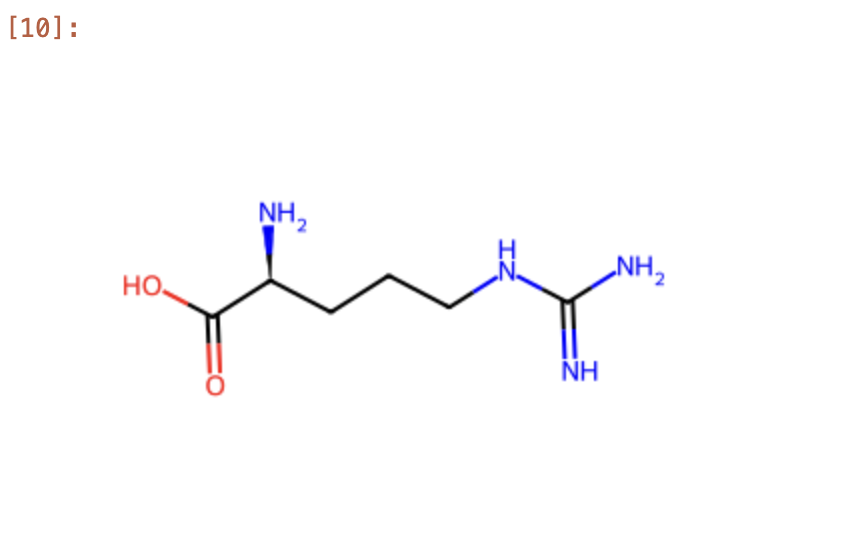
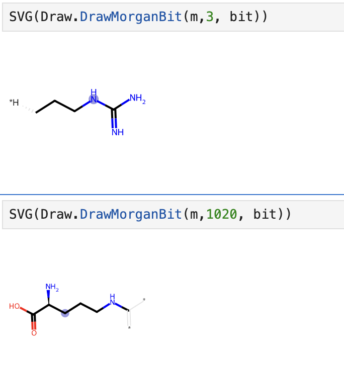

---
authors:
  - shubhamdang
date: 2024-04-15
categories:
  - se1
readtime: 2
---

# Draw Molecule and Generate Morgan Fingerprint Using RDKit

In this blog post, we will provide a comprehensive guide on how to draw a molecule and generate Morgan Fingerprints using RDKit. Our setup revolves around a single node with Jupyter notebook installed.


Let's start with a step-by-step process, starting from creating virtual machines on the Alces Cloud platform, followed by installation of jupyter lab and notebook and then analysis of molecule solubility.
<!-- more -->


## Launch the Instance  
All the steps to launch and connection to instance is provided in [link](../../docs/starter/instance.md).

## Install Jupter Notebook and Lab
All the steps to install jupter notebook and lab is provided in [link](./jupyter-lab-notebook.md).


## Setup
- First update package lists and install essential dependencies for jupyter lab and notebook.
    ```
    sudo dnf update
    sudo dnf install libXrender libXext
    ```


- Install RDkit using pip:
    ```
    python3 -m pip install rdkit
    ```

- Verification can be done using below command.
    ```
    rdkit --version
    ```


## Draw Molecule 
RDKit is a powerful toolkit used for drawing molecular structures, making it useful for visualizing and analysing molecules in various scientific fields such as chemistry and drug discovery. Here we are trying to draw the alanine molecule from SMILES provided as string.

- First of all import all the required libraries in the jupyter notebook cell.
    ```
    ln []:  import pandas as pd
            import numpy as np
            from rdkit import Chem
            from rdkit.Chem import AllChem
            from rdkit.Chem import Draw
    ```

- Now pass the SMILES to function and draw the molecule.
    ```
    ln []:  m = Chem.MolFromSmiles('C(C[C@@H](C(=O)O)N)CNC(=N)N')
            Draw.MolToImage(m)
    ```

-  It generate the molecule image like below.

    [](../images/molecule-analysis-rdkit-1.png)


## Generate Molecule Morgan Fingerprints

Morgan fingerprints encode the atom groups of a chemical into a binary vector with length and radius as its two parameters. The length refers to the lengths of the vector, while the radius represents the size of the atom groups.

### To create Morgan fingerprints, follow below steps:
- Initialize an empty dictionary named bit. Utilize the GetMorganFingerprintAsBitVect() function to generate Morgan fingerprints. Specify the atom radius for generating a single mapping characteristic and determine the number of unique path combinations to employ for mapping.

    ```
    m = Chem.MolFromSmiles('C(C[C@@H](C(=O)O)N)CNC(=N)N')
    bit={}
    morganfp=AllChem.GetMorganFingerprintAsBitVect(m,useChirality=True, radius=5, nBits = 1024, bitInfo=bit)
    ```


- Convert the Morgan fingerprint object to a numpy array for further computation

    ```
    #Remember the mol object wil be structured as 0s and 1s in the end and 1s will represent
    #thethe mapped molecule fingerprints while np.array and np.zero functions will be created for further vector processing
    #np.nonzero function to indentify the positions of the present molecular structurs

    mfpvector = np.array(morganfp)
    print(np.nonzero(mfpvector))

    Output
    ------
    (array([   1,    3,   80,  110,  128,  139,  140,  147,  197,  330,  353,
        389,  427,  553,  565,  623,  650,  667,  708,  739,  752,  786,
        807,  820,  852,  884,  887,  893,  894,  983, 1002, 1018, 1020]),)
    ```

- Draw the first Morgan bit structure number 3. The mapped structure will be shown in black lines and blue circle

    ```
    from IPython.display import SVG
    SVG(Draw.DrawMorganBit(m,3, bit))
    ```

- Draw Morgan bits number 1020, it is biggest chunk of the alanine molecule.
    ```
    SVG(Draw.DrawMorganBit(m,1020, bit))
    ```

    [](../images/molecule-analysis-rdkit-2.png)

!!! note 
    For more information and operations, please check the RDKit documentation [link](https://www.rdkit.org/docs/GettingStartedInPython.html)