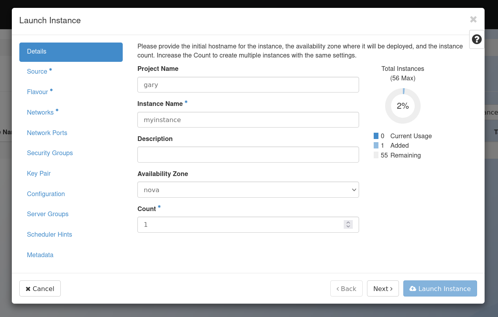
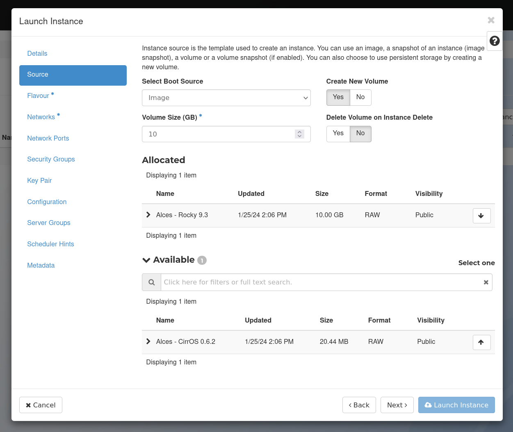
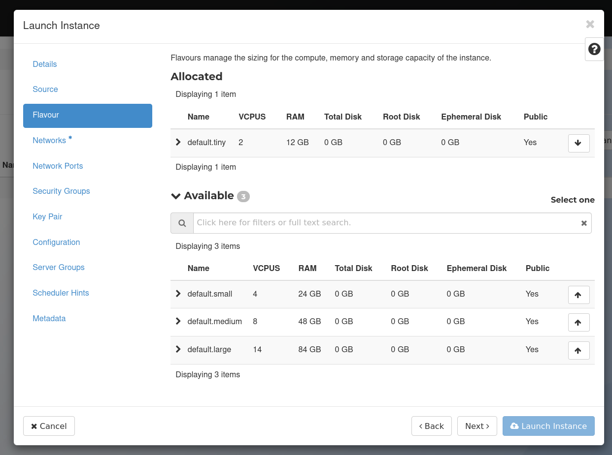
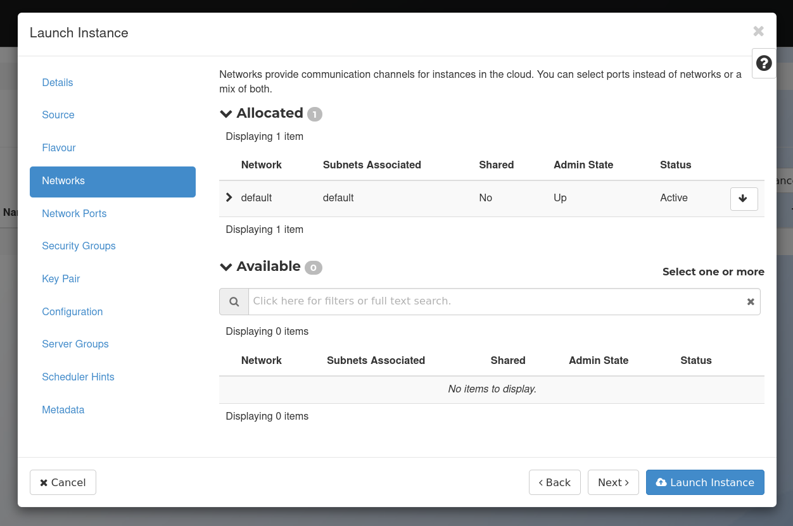
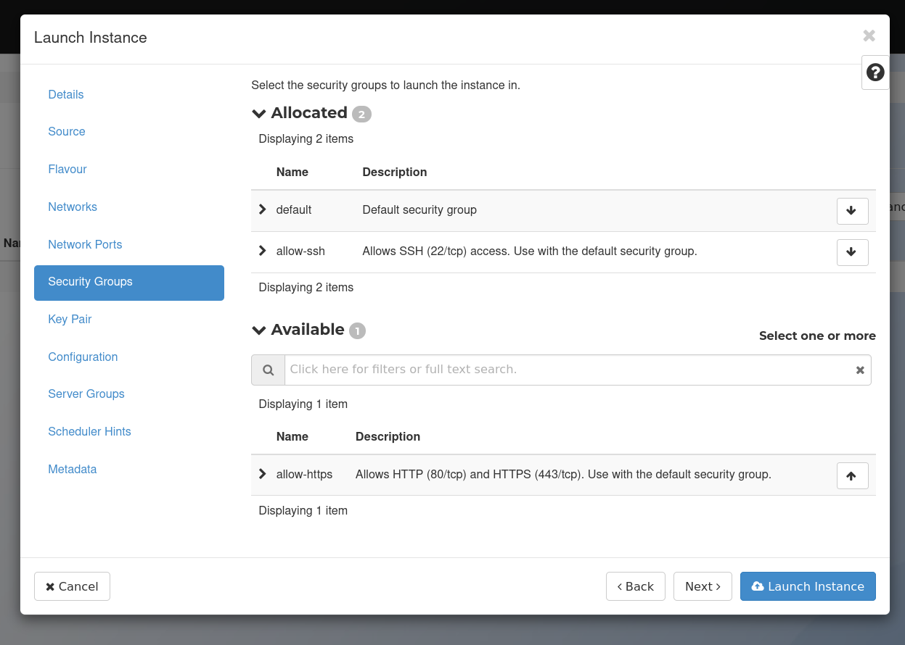
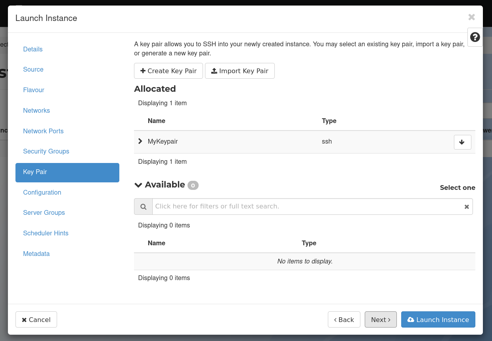
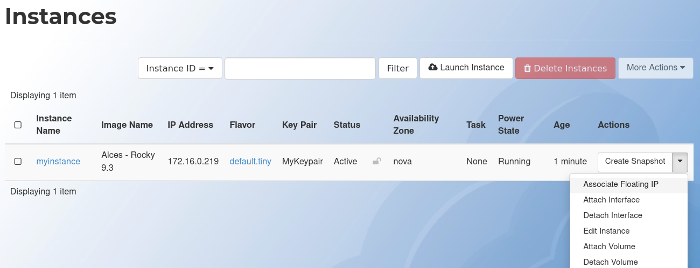
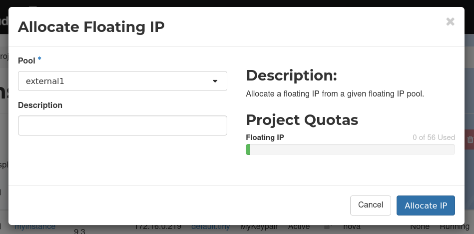
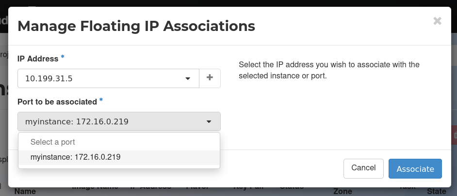

---
authors:
  - shubhamdang
date: 2024-03-06
categories:
  - se1
readtime: 2
---

# Setup OpenMPI and Build/Execute a MPI Job
In this blog, we'll guide you through the seamless installation of a OpenMPI on a RHEL-based operating system, building and running a MPI job. Our setup involves a single node.

Let's start with a step-by-step process, starting from creating virtual machines on the Alces Cloud platform, leading up to the installation of OpenMPI and then execution of the MPI job.
<!-- more -->

## Launch the Instance

=== "GUI"
    To launch your instance on Alces Cloud you can utilise the Launch Instance wizard.

    On the left side bar, navigate to `Compute` and then `Instances`. On the top right, click `Launch Instance` to open the wizard. Choose a suitable name for your instance, then  click `Next`.

    [](docs/starter/img/instance-wizard-1.png)

    Choose an image from the available list by pressing the up arrow next to the desired image, as well as a suitable volume size. Note: different images may have different requirements - you can view these by pressing the arrow to the left of the image name. Click `Next`.

    [](docs/starter/img/instance-wizard-2.png)

    Choose the flavor size for your instance. More information on the available flavors can be found [here](../compute/flavors.md). Click `Next`.

    [](docs/starter/img/instance-wizard-3.png)

    Choose the network to attach your instance to. Your project will come with a default network already configured for you to use. More information on networks can be found [here](../networking/networks.md). 

    Ensure the `default` network is selected and then click `Next` twice to move to the `Security Group` section.

    [](docs/starter/img/instance-wizard-4.png)

    Choose the security groups to apply to your instance. Your project will come with 3 security groups by default. More information on security groups can be found [here](../networking/secgroups.md).

    Select the `default` and `allow-ssh` security groups by pressing the up arrow next to these, then click `Next`.

    [](docs/starter/img/instance-wizard-5.png)

    Ensure the key pair you created earlier is selected, and then click on `Launch Instance` to launch it.

    [](docs/starter/img/instance-wizard-6.png)

    Launching your instance may take a few moments, after which it will be shown in the `Running` state on your `Instances` page.

    ##Connecting to your Instance

    In order to connect to your instance, you will need to associate a floating IP with the instance. Click the drop down arrow to the right of your instance and then select `Associate Floating IP`.

    [](docs/starter/img/instance-wizard-7.png)

    To allocate a new floating IP to your project, press the `+` button and then `Allocate IP`.

    [](docs/starter/img/instance-wizard-8.png)

    Ensure the IP that was just allocated is selected, and then select your instance from the drop down menu. Click `Associate` to then associate the IP.

    [](docs/starter/img/instance-wizard-9.png)

    You should now be able to SSH to your instance using floating IP and the `.pem` file downloaded earlier. This can be done using the `ssh` command on most Linux systems. Different images may require you to login as a different user - more information on the standard Alces images can be found [here](../compute/images.md).

    You may also be asked to accept the instance host key the first time you connect to a new instance. Type `yes` here to continue.

    ```
    [user@fedora ~]$ ssh -i MyKeypair.pem rocky@10.199.31.5
    The authenticity of host '10.199.31.5 (10.199.31.5)' can't be established.
    ED25519 key fingerprint is SHA256:87OxF7SkU/D6jXbY9XmwElnME9fK6qUaBVlTDlbVnDQ.
    This key is not known by any other names
    Are you sure you want to continue connecting (yes/no/[fingerprint])? yes
    Warning: Permanently added '10.199.31.5' (ED25519) to the list of known hosts.
    [rocky@myinstance ~]$ 
    ```


=== "CLI"

    Instances are virtual machines that run inside the cloud, Before we launch an instance we need to gather the following information:

    - Instance source can be an image, snapshot, or block storage volume that contains an image or snapshot.
    -  Name of the instance.
    - The flavor for your instance, which defines the compute, memory, and storage capacity of nova computing instances.
    - A key pair for your instance, which are SSH credentials that are injected into images when they are launched.
    - A security group that defines which incoming network traffic is forwarded to instances.
    - Any user data files. A user data file is a special key in the metadata service that holds a file that cloud-aware applications in the guest instance can   access.
    - If needed you can assign a floating (public) IP address to a running instance to access the instance on the public network.
    - You can also attach a block storage device, or volume, for persistent storage.


    ### Collect Parameters to launch an virtual machine

    Before you begin, source the OpenStack RC file to fetch all the information to required to create a instance.

    List the available flavors.
    ```bash
    openstack flavor list
    +--------------------------------------+----------+-------+------+-----------+-------+-----------+
    | ID                                   | Name     |   RAM | Disk | Ephemeral | VCPUs | Is Public |
    +--------------------------------------+----------+-------+------+-----------+-------+-----------+
    | 3bd3b3e8-b1c0-4968-868a-d411f03aa0b6 | p1.small | 49152 |    0 |      1228 |     6 | False     |
    | b8ac5f5e-6fcb-4f4f-ac6f-98ac1443ca1c | p1.large | 98304 |    0 |      2456 |    12 | False     |
    +--------------------------------------+----------+-------+------+-----------+-------+-----------+
    ```

    List the available Images
    ```bash
    openstack image list
    +--------------------------------------+----------------------+--------+
    | ID                                   | Name                 | Status |
    +--------------------------------------+----------------------+--------+
    | b7e0d27f-1266-4069-a9b8-fb8a71f25421 | Rocky 9.3            | active |
    | 8711c1da-71f8-4c09-85bd-6efdc2346188 | Ubuntu 22.04.3 (LTS) | active |
    +--------------------------------------+----------------------+--------+
    ```

    List the available Key Pairs
    ```bash
    openstack keypair list
    +-------------+-------------------------------------------------+------+
    | Name        | Fingerprint                                     | Type |
    +-------------+-------------------------------------------------+------+
    | alces_key   | 8a:cf:tc:b1:c8:82:46:d0:c6:e9:1f:98:b8:32:02:04 | ssh  |
    +-------------+-------------------------------------------------+------+
    ```

    List the available security Groups
    ```bash
    openstack security group list
    +--------------------------------------+-------------+-------------------------------------------+----------------------------------+------+
    | ID                                   | Name        | Description                               | Project                          | Tags |
    +--------------------------------------+-------------+-------------------------------------------+----------------------------------+------+
    | a5c693ab-431c-4059-b0a2-e64e9636e51d | allow-https | Allows HTTP (80/tcp) and HTTPS (443/tcp). | 17234a6cc8954d748ed74a31680ea39b | []   |
    | cc99563e-1110-494b-8b3f-d411c8ece659 | allow-ssh   | Allows SSH (22/tcp) access.               | 17234a6cc8954d748ed74a31680ea39b | []   |
    | df9dc0fb-0d91-4e06-8aa5-477c6b1fe254 | default     | Default security group                    | 17234a6cc8954d748ed74a31680ea39b | []   |
    +--------------------------------------+-------------+-------------------------------------------+----------------------------------+------+
    ```


    List the available Networks
    ```bash
    openstack network list
    +--------------------------------------+-----------------------+--------------------------------------+
    | ID                                   | Name                  | Subnets                              |
    +--------------------------------------+-----------------------+--------------------------------------+
    | c681d94b-e2ec-4b73-89bf-9943bcce3255 | external1             | 8a1961f9-030c-419e-9bf0-66875031073f |
    | cff8f325-db1b-4812-974a-9bee346a84bd | alces-testing-default | 920ba89b-4f27-4c35-8862-9d457bc6a677 |
    +--------------------------------------+-----------------------+--------------------------------------+
    ```

    ### Launch Virtual Machine and associate floating IP

    After you collect required parameters, run the following command to launch an instance. Specify the server name, flavor ID, image ID, network ID, keypair Name and security group ID.

    ```bash
    openstack server create --flavor 3bd3b3e8-b1c0-4968-868a-d411f03aa0b6 --image b7e0d27f-1266-4069-a9b8-fb8a71f25421 --security-group default --security-group allow-https --security-group allow-ssh  --key-name shubham_key --network cff8f325-db1b-4812-974a-9bee346a84bd --boot-from-volume 20 --wait myvm
    ```

    Once Virtual machine is created we can assign floating ip to the instance so that we can access the machine on public network.

    First we need to find for floating IPs that are available to allocate to the virtual machine, If `Fixed IP Address` is `None` then floating IPs are available.

    ```bash

    openstack floating ip list
    +--------------------------------------+---------------------+------------------+------+--------------------------------------+----------------------------------+
    | ID                                   | Floating IP Address | Fixed IP Address | Port | Floating Network                     | Project                          |
    +--------------------------------------+---------------------+------------------+------+--------------------------------------+----------------------------------+
    | 20319840-3043-4915-bcf4-f53098450f2e | 10.199.31.3         | None             | None | c681d94b-e2ec-4b73-89bf-9943bcce3255 | 17234a6cc8954d748ed74a31680ea39b |
    | cb8414b6-4ed0-4987-bc9b-298ac8a62704 | 10.199.31.116       | None             | None | c681d94b-e2ec-4b73-89bf-9943bcce3255 | 17234a6cc8954d748ed74a31680ea39b |
    +--------------------------------------+---------------------+------------------+------+--------------------------------------+----------------------------------+

    ```

    Otherwise we need to allocate floating IP from the external network pool, in our example name of external network is `external1`.
    
    ```bash
    openstack floating ip create
    ```

    Once the flaoting IP is available, Associate an IP address with an instance in the project, as follows:
    ```bash
    openstack server add floating ip INSTANCE_ID FLOATING_IP_ADDRESS

    # Example
    openstack server add floating ip myvm 10.199.31.3
    ```


    Verification of Server creation and assocation of floating IP can be done by the below command.

    ```bash
    openstack server list
    +--------------------------------------+------+--------+-------------------------------------------------+--------------------------+--------+
    | ID                                   | Name | Status | Networks                                        | Image                    | Flavor |
    +--------------------------------------+------+--------+-------------------------------------------------+--------------------------+--------+
    | 00ab05c7-9590-47a2-9d20-1647fca5e0bb | myvm | ACTIVE | alces-testing-default=10.199.31.3, 172.16.0.158 | N/A (booted from volume) | dan1   |
    +--------------------------------------+------+--------+-------------------------------------------------+--------------------------+--------+
    ```

## Setup OpenMPI and execute a Job

**Installtion of OpenMPI**

Below are the step to install OpenMPI on the RHEL based operating System.

```bash
sudo dnf makecache --refresh
sudo dnf -y install openmpi
```

**Build and Execute the MPI job**

Sample MPI job script is provided below.

```markdown
#include <mpi.h>
#include <stdio.h>

int main(int argc, char** argv) {
    // Initialize the MPI environment
    MPI_Init(NULL, NULL);

    // Get the number of processes
    int world_size;
    MPI_Comm_size(MPI_COMM_WORLD, &world_size);

    // Get the rank of the process
    int world_rank;
    MPI_Comm_rank(MPI_COMM_WORLD, &world_rank);

    // Get the name of the processor
    char processor_name[MPI_MAX_PROCESSOR_NAME];
    int name_len;
    MPI_Get_processor_name(processor_name, &name_len);

    // Print off a hello world message
    printf("Hello world from processor %s, rank %d out of %d processors\n",
           processor_name, world_rank, world_size);

    // Finalize the MPI environment.
    MPI_Finalize();
}
```

Below are the step to build and execute the MPI job.

```bash
# copy the script content in file mpi-hello-world.c
vi mpi-hello-world.c

# load mpi module 
module load mpi

# build the mpi job 
mpicc -o mpi mpi-hello-world.c

# Execute the MPI job
mpirun -np 4 mpi

# Results
Hello world from processor myinstance.novalocal, rank 1 out of 4 processors
Hello world from processor myinstance.novalocal, rank 2 out of 4 processors
Hello world from processor myinstance.novalocal, rank 0 out of 4 processors
Hello world from processor myinstance.novalocal, rank 3 out of 4 processors
```


