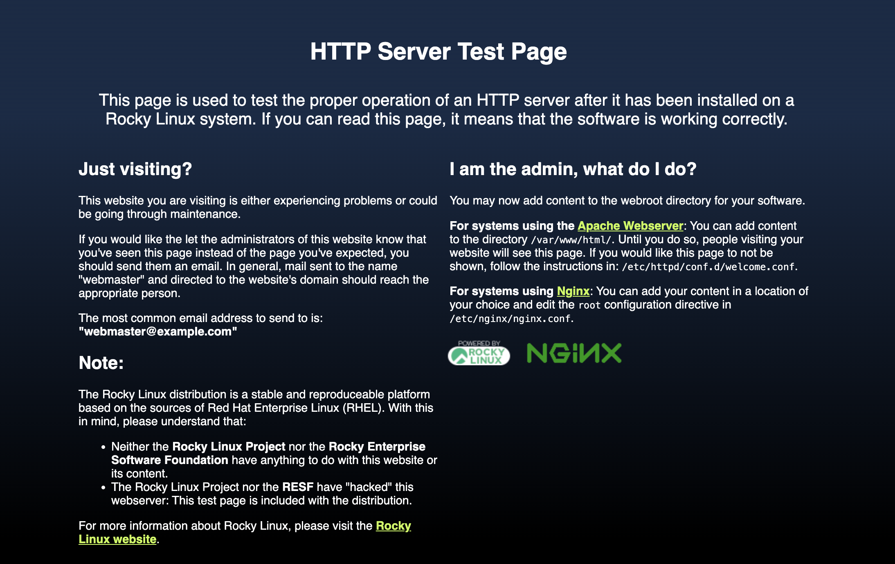
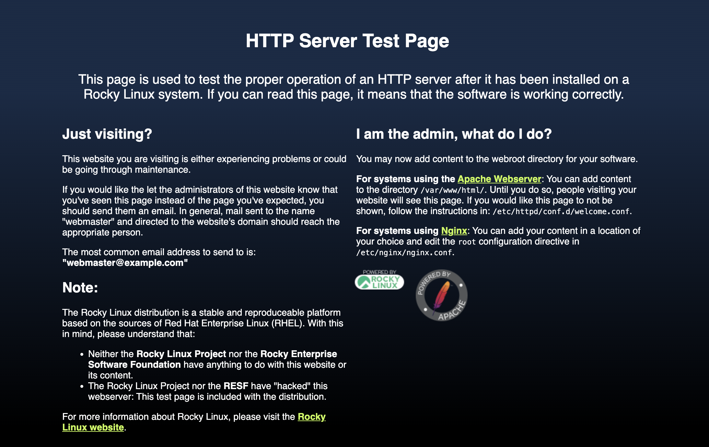

---
authors:
  - shubhamdang
date: 2024-03-15
categories:
  - se1
readtime: 5
---

# Setup Nginx/Apache Webserver
In this blog, we'll guide you through the installation of a NGINX and Apache webserver on a rocky based operating system.

Let's start with a step-by-step process, starting from creating virtual machines on the Alces Cloud platform, leading up to the installation of NGINX and Apache webserver.
<!-- more -->

## Launch the Instance  
All the steps to launch and connection to instance is provided in [link](../../docs/starter/instance.md).

!!! note
    Just Make sure port `22, 80, 443` is opened as ingress rule in security group that is attached to the instance.
    If `firewalld` is enabled on the server, in order to allow external connection on your nginx web server which runs on port `80` by default we need to update the setting by running the below command
    ```
    sudo firewall-cmd --permanent --add-service=http
    ```

    To verify that the http firewall service was added correctly, you can run:
    ```
    sudo firewall-cmd --permanent --list-all
    
    Output
    ------
    public
    target: default
    icmp-block-inversion: no
    interfaces: 
    sources: 
    services: cockpit dhcpv6-client http ssh
    ports: 
    protocols: 
    masquerade: no
    forward-ports: 
    source-ports: 
    icmp-blocks: 
    rich rules: 
    ```

    To apply the changes and reload the firewalld run below command
    ```
    sudo firewall-cmd --reload
    ```


## Setup Nginx

Nginx is available in Rocky’s default repositories so you can install it with a single command.
```
sudo dnf update -y
sudo dnf install -y nginx 
```

After the installation of nginx, enable and start the nginx web server. 
```
sudo systemctl enable nginx
sudo systemctl start nginx
```

### Verify Nginx
You can check the web server is up and running by using the below command 
```
systemctl status nginx

Output
------
● nginx.service - The nginx HTTP and reverse proxy server
     Loaded: loaded (/usr/lib/systemd/system/nginx.service; enabled; preset: disabled)
     Active: active (running) since Mon 2024-03-18 11:44:58 UTC; 2s ago
    Process: 50672 ExecStartPre=/usr/bin/rm -f /run/nginx.pid (code=exited, status=0/SUCCESS)
    Process: 50673 ExecStartPre=/usr/sbin/nginx -t (code=exited, status=0/SUCCESS)
    Process: 50674 ExecStart=/usr/sbin/nginx (code=exited, status=0/SUCCESS)
   Main PID: 50675 (nginx)
      Tasks: 5 (limit: 100136)
     Memory: 4.6M
        CPU: 42ms
     CGroup: /system.slice/nginx.service
             ├─50675 "nginx: master process /usr/sbin/nginx"
             ├─50676 "nginx: worker process"
             ├─50677 "nginx: worker process"
             ├─50678 "nginx: worker process"
             └─50679 "nginx: worker process"
```

You can also check the nginx is working properly or not by navigating to your server’s IP address, if it is working fine then it will open the the default Nginx landing page.

When you have your server’s IP address, enter it into your browser’s address bar:
```
http://server_ip
```

It will open the landing page of nginx like below.
[](images/setup-webserver-2.png)


### Manage Nginx server process
Various operations can be performed on the nginx process to change its state.

To stop the web server, run the below command.
```
sudo systemctl stop nginx
```

To start the web server, run the below command.
```
sudo systemctl start nginx
```

To stop and then start the web server, run the below command.
```
sudo systemctl restart nginx
```

Sometimes some configuration changes are done, in order to reload the nginx without dropping the connection run below command.
```
sudo systemctl reload nginx
```

Configure Nginx to start automatically when the server boots, run below command
```
sudo systemctl enable nginx
```

Configure Nginx not to start automatically when the server boots, run below command
```
sudo systemctl disable nginx
```

### Troubleshooting Tips
If you encounter issues, check the Nginx error logs for clues:
```
sudo journalctl -u nginx
```

!!! note
    For more information, refer to nginx docs [link](https://nginx.org/en/docs/)


## Setup Apache

Nginx is available in Rocky’s default repositories so you can install it with a single command.
```
sudo dnf update -y
sudo dnf install -y httpd 
```

After the installation of nginx, enable and start the nginx web server. 
```
sudo systemctl enable httpd
sudo systemctl start httpd
```

### Verify Apache
You can check the web server is up and running by using the below command 
```
systemctl status httpd

Output
------
● httpd.service - The Apache HTTP Server
     Loaded: loaded (/usr/lib/systemd/system/httpd.service; enabled; preset: disabled)
     Active: active (running) since Mon 2024-03-18 11:51:50 UTC; 6s ago
       Docs: man:httpd.service(8)
   Main PID: 51098 (httpd)
     Status: "Started, listening on: port 80"
      Tasks: 213 (limit: 100136)
     Memory: 42.0M
        CPU: 97ms
     CGroup: /system.slice/httpd.service
             ├─51098 /usr/sbin/httpd -DFOREGROUND
             ├─51099 /usr/sbin/httpd -DFOREGROUND
             ├─51100 /usr/sbin/httpd -DFOREGROUND
             ├─51101 /usr/sbin/httpd -DFOREGROUND
             └─51102 /usr/sbin/httpd -DFOREGROUND
```

You can also check the Apache is working properly or not by navigating to your server’s IP address, if it is working fine then it will open the the default Apache landing page.

When you have your server’s IP address, enter it into your browser’s address bar:
```
http://server_ip
```

It will open the landing page of Apache like below.
[](images/setup-webserver-1.png)


### Manage Apache server process
Various operations can be performed on the apache process to change its state.

To stop the web server, run the below command.
```
sudo systemctl stop httpd
```

To start the web server, run the below command.
```
sudo systemctl start httpd
```

To stop and then start the web server, run the below command.
```
sudo systemctl restart httpd
```

Sometimes some configuration changes are done, in order to reload the Apache without dropping the connection run below command.
```
sudo systemctl reload httpd
```

Configure Apache to start automatically when the server boots, run below command
```
sudo systemctl enable httpd
```

Configure Apache not to start automatically when the server boots, run below command
```
sudo systemctl disable httpd
```
### Troubleshooting Tips
If you encounter issues, check the Apache error logs for clues:
```
sudo journalctl -u httpd
```

!!! note
    For more information, refer to Apache docs [link](https://httpd.apache.org/docs/)
